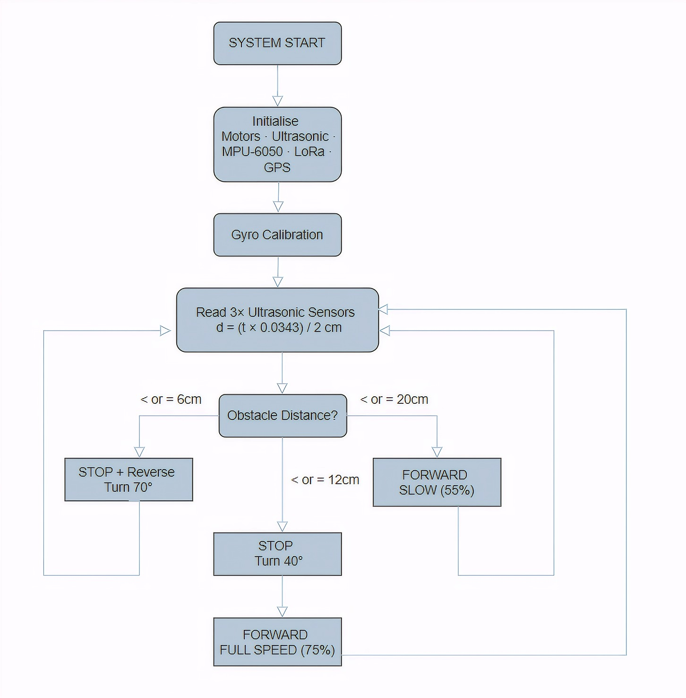

# 🚑 Post-Disaster Human Detection Rover using LoRa Mesh Network

> An autonomous swarm-based search and rescue system that combines **Edge Impulse AI**, **ESP32-CAM**, **Raspberry Pi Pico W**, **ESP8266**, **LoRa Mesh Networking**, and **GPS localization** for real-time post-disaster human detection and communication.

---

# 📖 Project Overview

In natural disasters such as earthquakes, landslides, and collapsed buildings, conventional communication infrastructure may become unavailable, making rescue operations difficult.

This project presents a **dual-rover cyber-physical search and rescue system** capable of autonomously navigating disaster environments, detecting trapped humans using AI vision, determining GPS coordinates, and transmitting alerts through a long-range **LoRa Mesh Network** to a remote rescue station.

Each rover acts as both a search unit and a communication relay, allowing reliable message forwarding even when direct communication with the base station is not possible.

---

# ✨ Features

- 🤖 AI-based Human Detection using Edge Impulse
- 🚙 Autonomous Obstacle Avoidance
- 📡 Long-Range LoRa Mesh Communication
- 📍 GPS-based Survivor Localization
- 🌐 Multi-Rover Swarm Architecture
- 📶 Packet Forwarding Between Rovers
- 📊 RSSI Monitoring
- ⚡ Real-Time Alert Generation
- 📱 Remote Rescue Station Monitoring

---

# 🛠️ Hardware Components

- Raspberry Pi Pico W
- ESP32 AI Thinker Camera
- ESP8266 NodeMCU
- SX1278 LoRa (433 MHz)
- Neo-6M GPS Module
- MPU6050 IMU
- HC-SR04 Ultrasonic Sensors
- L298N Motor Driver
- DC Geared Motors
- Li-ion Battery Pack

---

# 💻 Software & Tools

- MicroPython
- Arduino IDE
- Edge Impulse Studio
- LoRa Library
- TinyGPS++
- VS Code / Thonny IDE

---

# 🏗️ System Architecture

The system consists of two autonomous rovers and one rescue station. Each rover integrates a Raspberry Pi Pico W for motion control, an ESP32-CAM for AI-based human detection, an ESP8266 for LoRa communication, GPS for localization, and ultrasonic sensors for obstacle avoidance. The rescue station receives alerts and displays survivor information.

---

# 🔄 Navigation Flowchart

The rover continuously explores the environment by reading ultrasonic sensor data, avoiding obstacles, performing AI-based human detection, and transmitting emergency alerts through the LoRa mesh network.

---

# ⚙️ Working Principle

1. System initializes all sensors and communication modules.
2. Rover autonomously navigates using ultrasonic sensors.
3. ESP32-CAM performs real-time AI-based human detection.
4. Upon detecting a person, GPS coordinates are acquired.
5. Detection information is forwarded to the ESP8266.
6. ESP8266 transmits the packet through the LoRa Mesh Network.
7. Intermediate rovers relay packets when required.
8. Rescue station receives and displays the alert.

---

# 📸 Experimental Results

## Human Detection

The Edge Impulse model successfully detects human presence and generates detection messages with high confidence.

---

## Alert Received at Rescue Station

When a human is detected, the rescue station receives an alert containing:

- Human detection status
- GPS coordinates
- Packet ID
- RSSI value

This enables rapid localization of survivors.

---

## LoRa Packet Transmission

The communication log demonstrates successful transmission and forwarding of detection packets between rovers through the LoRa mesh network before reaching the rescue station.

---

# 📈 Key Achievements

- ✅ Autonomous navigation
- ✅ AI-based human detection
- ✅ GPS localization
- ✅ Long-range LoRa communication
- ✅ Multi-hop packet forwarding
- ✅ Reliable rescue station alerts

---

# 🌍 Applications

- 🚑 Search and Rescue Missions
- 🌋 Earthquake Response
- 🌊 Flood Rescue
- ⛰️ Landslide Operations
- 🏭 Industrial Safety
- 🪖 Defence Surveillance
- 🌲 Forest Search Operations

---

# 🚀 Future Improvements

- SLAM-based autonomous mapping
- Thermal camera integration
- Multi-hop routing optimization
- Drone and rover collaboration
- Cloud-based monitoring dashboard
- Victim classification using deep learning

---

# 👨‍💻 Author

**Harikrishnan N.**

B.Tech Electrical and Electronics Engineering

Amrita Vishwa Vidyapeetham
